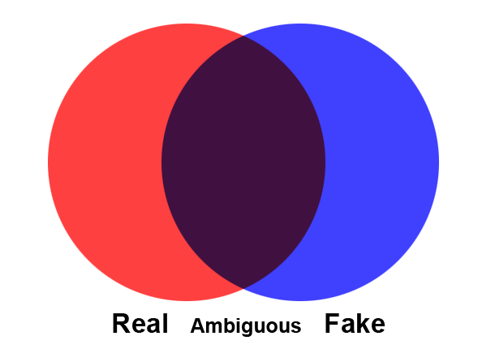

FakeMark
========

Summary
-------
FakeMark is a simple marker added to media files to signify
that the content has been altered significantly from the original. The intent
is to enable content producers to signal that the media was intentionally altered
and prevent many use cases of misunderanding when the media is shared or taken
out of context.
The goal of FakeMark is not to propose a secure solution
to the problem of fake media, but to enable new norms to grow and evolve surrounding
how altered media is produced and consumed.

Background
-------

Media presented for consumption generally has a tacit grounding: real, fake, or ambiguous.

Real media is meant to be a depiction of reality while fake media has been
altered for effect. Media can also be intentionally presented with ambiguous provenance
in order to provoke more critical thought from the viewer. However, the advance
of technology has seen the rapid increase of fake and ambiguous media in popular culture.

FakeMark is a small, first step to allow media producers a simple way of signaling
that their content is intented as fake. The initial use case focuses on
providing researchers and
those showcasing media manipulation techniques a tool to keep their produced works from
being easily shared and misunderstood out of context. However, as other domains
find explicit visually signalling useful, FakeMark will aim to adapt to fix other contexts.

FakeMark is not intended to be a secure solution to adversaries. Use of FaceMark is strictly
voluntary as there are often very compelling reasons to present media that is ambiguous in nature. FakeMark is instead meant to be
a starting point to establish richer social norms on how media is produced and
shared.

Best Practices
-------

Currently, FakeMark can be applied to visual media such as images or videos. The content
consists of a capital blue "F" and should appear in the bottom right corner. This
repo contains refrence implementations, but content providers are free to reinterpret
these within the spirit of the proposal.

This repo will continue to communicate best practices with refrence implementations.

Contribute
-------
We welcome feedback to FakeMark, such as:

  * Reference Implementations
  * Simple Design Guides
  * Suggestions for Use

If you have ideas for how FakeMark can be more effective, please open a github issue or pull request.

As a general design guide: FakeMark is intended to be dead-simple to implement
(one of the reasons a "Blue F" was chosen is that a baseline implementation can be done
to any image by simply adding four rectangles in two colors). We welcome all suggestions,
but explicitly favor any proposal not increasing the complexity of deploying FakeMark.

